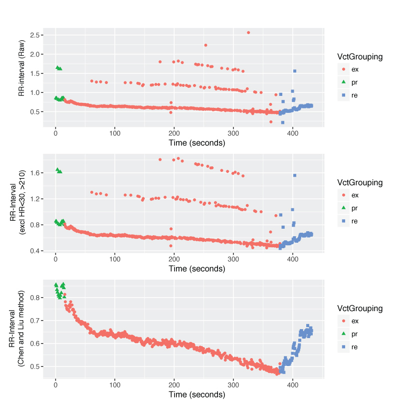

# E-ECG
Method for obataining reliable normal R to R intervals in exercise ECGs.

##Further documentation will be added at a later time

### Basic example
run using `Rscript E-ECG.main.R example/example_participants.qrs.csv` to create 1) a file containing heart rate variables in rest, exercise and recovery, 2) a plot (.pdf) that shows the RR-interval in time for inspection:

